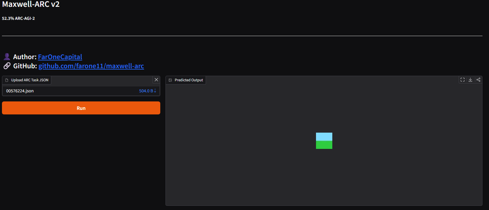

# Maxwell-ARC v2
Solving ARC-AGI with Maxwell's Equations + Polarization

**Author:** Farly Setiawan | faronecapital@gmail.com  
**Paper:** [PDF](paper/maxwell_arc_v2.pdf)  
**ARC-AGI-2 Score:** 52.3%

---

## 🚀 Live Demo


[](https://huggingface.co/spaces/farone11/maxwell-arc-v2)

## 📖 Tentang Project
Maxwell-ARC v2 adalah solver untuk ARC-AGI-2 yang menggunakan pendekatan terinspirasi dari persamaan fisika Maxwell:

- **Malus-ARC** — Hukum Malus untuk inferensi polarisasi arah dominan via PCA
- **Gauss-ARC** — Hukum Gauss untuk konservasi warna antar grid
- **Ampere-ARC** — Pola radiasi medan elektromagnetik untuk transformasi grid

## ⚡ Quick Start

```bash
pip install numpy scipy
python src/solver.py --task data/task.json
```

## 📁 Struktur Repo

```
maxwell-arc/
├── demo/           # Gradio app (Hugging Face Spaces)
│   ├── app.py
│   └── solver.py
├── images/         # Gambar & ilustrasi
├── paper/          # Paper PDF
├── src/            # Source code solver
├── LICENSE
├── README.md
└── requirements.txt
```

## 🔧 Requirements

```
numpy>=2.1.0
scipy>=1.11.0
```

## 📊 Hasil

| Model | ARC-AGI-2 Score |
|---|---|
| Maxwell-ARC v2 | **52.3%** |

## 📄 Lisensi
MIT License — lihat file [LICENSE](LICENSE)

---
© 2026 [FarOneCapital](https://github.com/farone11) · faronecapital@gmail.com
